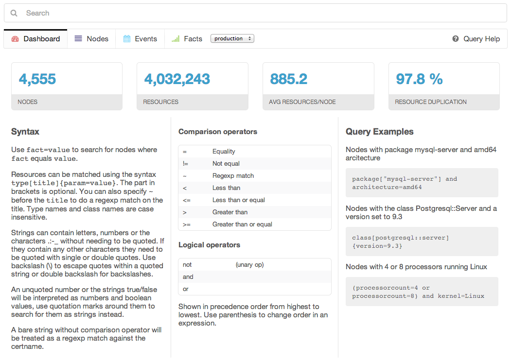
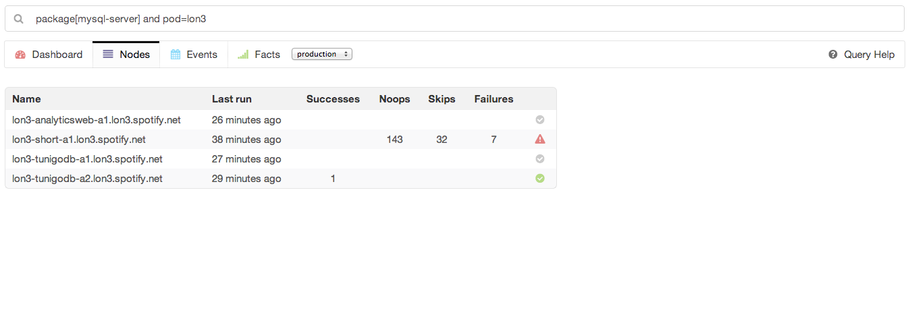
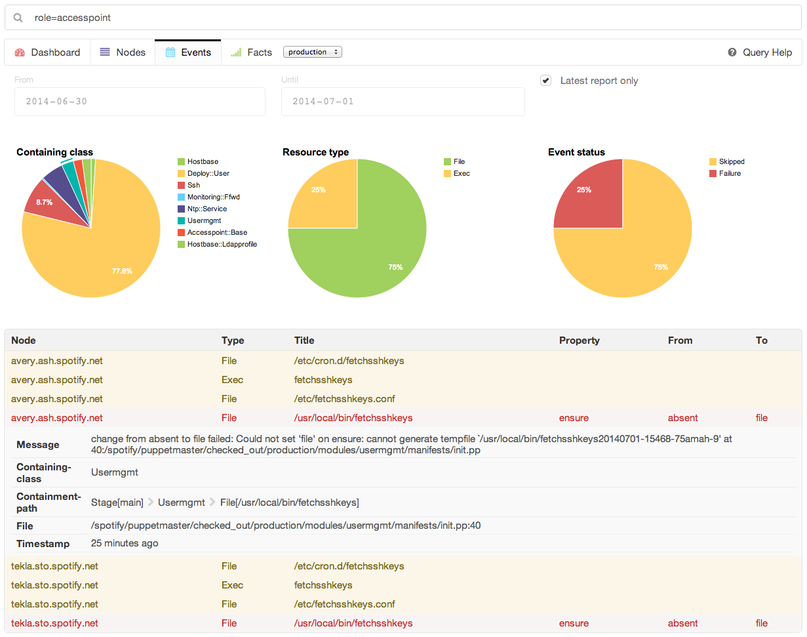
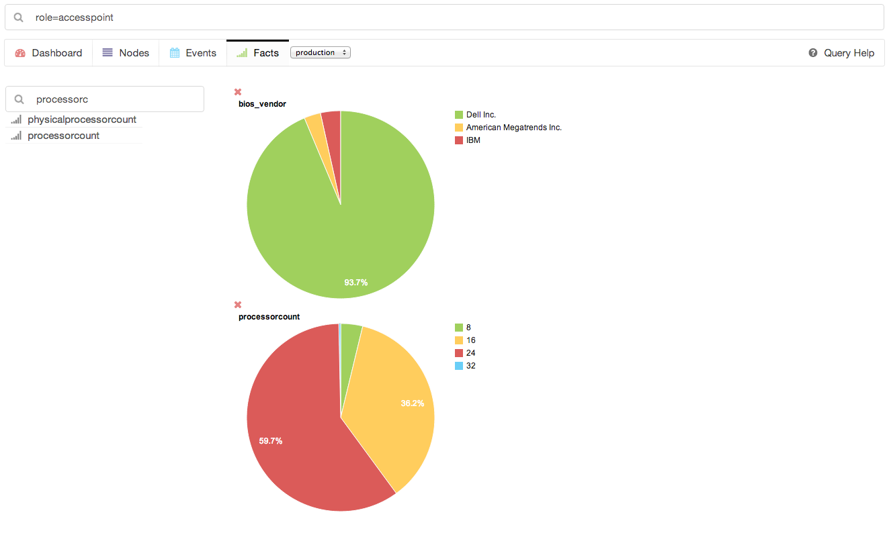

# Puppet Explorer - Never sailed straighter

### Overview

Puppet Explorer is a web application for PuppetDB that lets you explore your
Puppet data.
It is made using AngularJS and CoffeeScript and runs entirely on the client
side, so the only backend that is needed is PuppetDB itself and a web server to
share the static resources.

It has the same query language as the popular Puppet module
[dalen-puppetdbquery](https://forge.puppetlabs.com/dalen/puppetdbquery).
This lets you easily filter for a selection of nodes and show the events or
facts for only them. So you can handle hosts as groups without needing to have
predefined groups, just make them up as you need and click on the pie charts to
drill down further. The JavaScript version of this query parser is available as
a separate component so you can use it in your own projects easily,
[node-puppetdbquery](https://github.com/dalen/node-puppetdbquery).

All views in the application are made to be able to link directly to them, so
it is easy to share information you find with coworkers.

It has support for multiple PuppetDB servers.

### Screenshots

##### The dashboard:

##### Node search:

##### Events view and filtering:

##### Facts view:

### Demo

Try it out live with some made up AWS data at
[demo.puppetexplorer.io](http://demo.puppetexplorer.io)

### Installation

The recommended way to install it is on the same host as your PuppetDB instance.
Then proxy /api to port 8080 of your PuppetDB instance (except the /commands
endpoint). This avoids the need for any
[CORS](http://en.wikipedia.org/wiki/Cross-origin_resource_sharing) headers.

It is possible to have it on a separate domain from your PuppetDB though. If you
do, make sure you have the correct `Access-Control-Allow-Origin` header and a
`Access-Control-Expose-Headers: X-Records` header.

You need to copy config.js.example to config.js and modify it for your needs.

To simplify installation you can use the
[spotify-puppetexplorer](https://forge.puppetlabs.com/spotify/puppetexplorer)
Puppet module.

### Dependencies

It is using the V4 PuppetDB API from PuppetDB 3.2. Version 1.5.0 works with
PuppetDB 2.3.x, but the current version only works with PuppetDB 3.x.

Versions of Puppet prior to 4.0, converted Facter's facts to string, limiting the
puppetexplorer's ability to compare them.  The
[stringifyfacts](https://docs.puppetlabs.com/puppet/3.8/reference/configuration.html#stringifyfacts)
Puppet parameter permits to disable this old behaviour.  Please note that Facter
2.3.0 or newer is required for this setting to take effect.

### Development and local testing

Install all required dependencies using `npm install` and the grunt cli tool
globally using `npm install -g grunt-cli`. Then you can build the
application using `grunt`. The results will be located in the `dist` directory.

Use `grunt serve` to start a local web server pointing to the demo site PuppetDB
instance.

Optionally you can use the `--puppetdb=url` option to specify a URL to proxy
PuppetDB connections to. Another way is to create a SSH tunnel to your PuppetDB
server, `ssh -L 8080:localhost:8080 puppetdb.example.com` and
`grunt serve --puppetdb=http://localhost:8080/`.

With `grunt watch` it will rebuild any source files that changes and put the
results in the `dist` directory.

To build a Debian package use `grunt build_debian`, this requires the
`devscripts` and `debhelper` packages to be installed.

To build a RPM use `grunt build rpm:snapshot`, this requires the `rpm-build`
package to be installed. The resulting RPM will be in `rpm/RPMS/noarch`.

### See also

 * [Puppetboard](https://github.com/nedap/puppetboard)
 * [Foreman](http://theforeman.org/)
 * [Puppet Enterprise](http://puppetlabs.com/puppet/puppet-enterprise)
